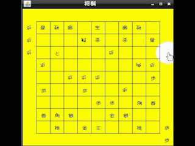
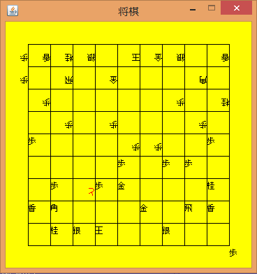

# アルゴリズム対戦将棋(Clojureのお勉強) #

　アルゴリズム同士で対戦する将棋です。サンプルとしてランダムに駒を動かし続けるアルゴリズムを入れておきます。まともなアルゴリズムはまだ敷居が高い…

    lein run -- src/syogi/test-algo1 src/syogi/test-algo2

## 画面イメージ ##

動ける位置にしか動けませんが、ランダムアルゴリズム VS ランダムアルゴリズムの対戦です。

